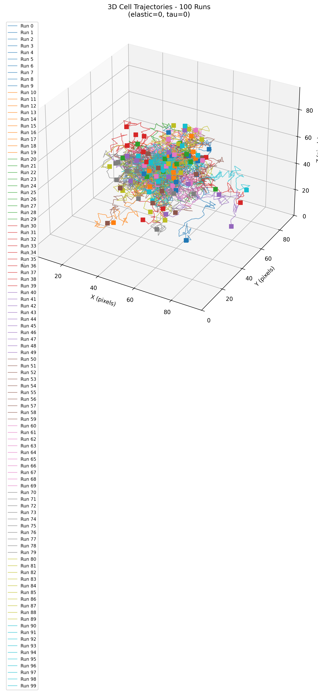
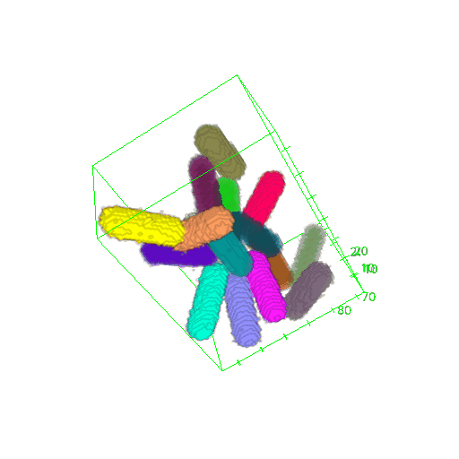
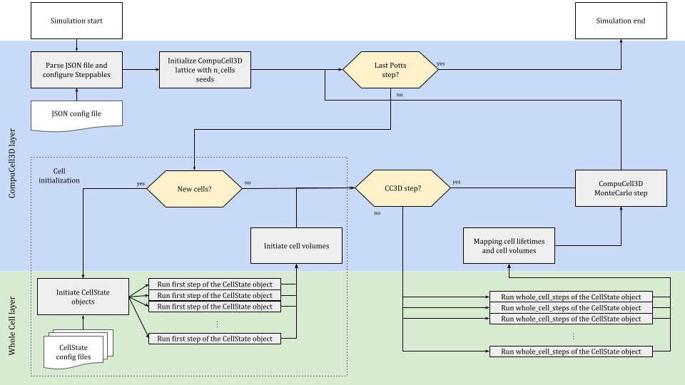

# 🧬 Whole-Cell Potts Model

This repository provides a coupled multi-scale framework of **CompuCell3D/CPM** for cell-scale geometry and interactions, and a **whole-cell translation kinetics model** (mRNA → protein) for intracellular dynamics, with a focus on cancerology and synthetic biology applications.

---

## Contents

- [Repository contents](#repository-contents)
- [Benchmarks](#benchmarks)
  - [01 — Tumor spheroid scalability](#01--tumor-spheroid-scalability)
  - [02 — Maxwell medium confinement](#02--maxwell-medium-confinement)
  - [03 — Bacteria whole-cell (ELMs)](#03--bacteria-whole-cell-elms)
- [Technical notes: how the coupling works](#technical-notes-how-the-coupling-works)
- [Docker / container build](#docker--container-build)
- [License](#license)
- [Contact](#contact)

---

## Repository contents

- **Coupled model**: CPM (shape, contacts, motion, division) ↔ whole-cell translation kinetics (ribosomes, tRNAs, protein production)
- **Custom CC3D plugins (C++)**: geometry and mechanics (including a **Maxwell viscoelastic medium**)
- **Benchmarks** designed to demonstrate scientific relevance and computational scalability
- **Container workflow** based on a pre-built DockerHub image: [`gdavid57/cc3d-compile`](https://hub.docker.com/r/gdavid57/cc3d-compile)

---

## Benchmarks

### 01 — Tumor spheroid scalability

**Benchmark folder:** [`benchmarks/01_spheroid_scalability/`](benchmarks/01_spheroid_scalability/)

Scales the coupled model from **1 → 1024 cells** to quantify runtime and assess feasibility for **tumor spheroid simulations** (hundreds to thousands of cells) on multi-core machines. The benchmark records timing vs. cell count as the spheroid grows.

<p align="center">
  <a href="benchmarks/01_spheroid_scalability/">
    
  </a>
  <a href="benchmarks/01_spheroid_scalability/">
    
  </a>
</p>

### 02 — Maxwell medium confinement

**Benchmark folder:** [`benchmarks/02_mechanical_confinement/`](benchmarks/02_mechanical_confinement/)

Studies the statistics of a single cell’s constrained motion under a **Maxwell viscoelastic medium** (elastic response + stress relaxation), as a proxy for **tumor cell confinement** in surrounding tissue. The benchmark runs multiple replicates and analyzes trajectories/MSD across parameter sweeps (elasticity, relaxation time).

<p align="center">
  <a href="benchmarks/02_mechanical_confinement/">
    
  </a>
  <a href="benchmarks/02_mechanical_confinement/">
    
  </a>
</p>

### 03 — Bacteria whole-cell (ELMs)

**Benchmark folder:** [`benchmarks/03_bacteria_whole_cell/`](benchmarks/03_bacteria_whole_cell/)

Couples a **rod-shaped bacterium geometry** (via CC3D plugins) with the intracellular translation kinetics model to track growth and division under different parameterizations. This benchmark is a stepping stone toward **Engineered Living Materials (ELMs)** applications where intracellular state impacts collective behavior.

<p align="center">
  <a href="benchmarks/03_bacteria_whole_cell/">
    
  </a>
</p>

---

## Run benchmarks (DockerHub)

The commands below use the **pre-built** DockerHub image [`gdavid57/cc3d-compile`](https://hub.docker.com/r/gdavid57/cc3d-compile) and mount your local checkout into the container (outputs are written on your machine).

```bash
# 0) One-time setup
docker pull gdavid57/cc3d-compile

# 1) Benchmark 01 — Tumor spheroid scalability
docker run --rm -it \
  -v "$(pwd)":/work \
  -w /work/benchmarks/01_spheroid_scalability \
  gdavid57/cc3d-compile \
  conda run -n cc3d_compile python multiprocessing_wc_script.py default_config.json

# 2) Benchmark 02 — Maxwell confinement: full sweep
docker run --rm -it \
  -v "$(pwd)":/work \
  -w /work/benchmarks/02_mechanical_confinement \
  gdavid57/cc3d-compile \
  conda run -n cc3d_compile python cell_brownian_motion_maxwell_constraint.py --sweep

# 3) Benchmark 03 — Bacteria whole-cell
docker run --rm -it \
  -v "$(pwd)":/work \
  -w /work/benchmarks/03_bacteria_whole_cell \
  gdavid57/cc3d-compile \
  conda run -n cc3d_compile python automated_wc_cc3d_script.py default_config.json

# 4) Generate all figures (after running benchmarks)
docker run --rm -it \
  -v "$(pwd)":/work \
  -w /work \
  gdavid57/cc3d-compile \
  conda run -n cc3d_compile python scripts/generate_all_figures.py
```

---

## Technical notes: how the coupling works

At a high level, the coupling alternates between:

- **CPM/CompuCell3D step(s)** to update cell geometry and interactions on the lattice
- **Whole-cell translation kinetics** to update intracellular state as a function of cell state (e.g., volume), producing outputs such as protein counts

To keep the coupled simulation tractable as the number of cells grows, the benchmarks use **multiprocessing** for the intracellular component: each cell’s translation step can be computed independently for a given Monte Carlo step (MCS), so per-cell updates are dispatched in parallel to worker processes and the updated state is then re-attached to the corresponding CC3D cell.

<p align="center">
  
</p>

---

## Docker / container build

For image build details (from source), contexts and options, see:
- **[`container_build/README.md`](container_build/README.md)**

---

## License

See **[`LICENSE`](LICENSE)**.

---

## Contact

**Dr Adélaïde Raguin**  
adelaide.raguin@u-bordeaux.fr
