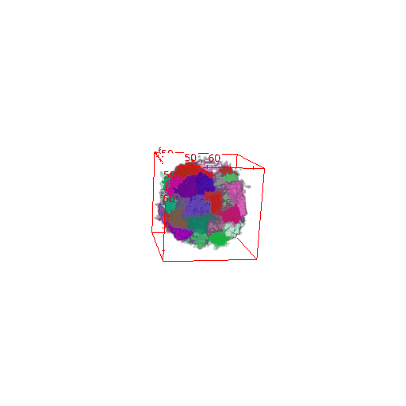
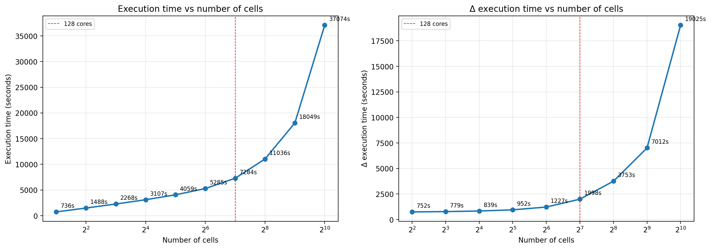

# Benchmark 01 — Tumor Spheroid Scalability

<p align="center">
  
  
</p>

## Objective

This benchmark evaluates the **computational scalability** of the coupled CPM + whole-cell model as the number of cells grows from 1 to 1024. The goal is to assess feasibility for realistic tumor spheroid simulations on multi-core machines.

## Method

A spheroid grows through successive cell divisions. At each doubling of the cell count, the simulation records the cumulative execution time. The benchmark was run on an **AMD CPU with 128 logical cores**, using multiprocessing for the intracellular translation step.

## How to run

```bash
python multiprocessing_wc_script.py default_config.json
```

## Results

### Execution time vs number of cells

<p align="center">
  
</p>

**Left panel:** Total execution time increases super-linearly with the number of cells, reflecting the growing computational load of both the CPM lattice updates and the per-cell translation kinetics.

**Right panel:** The incremental time (Δt) to double the cell count grows with cell number. The red dashed line marks the 128-core threshold: beyond this point, parallelization saturates and overhead costs become significant.

## Output files

- `results/csvs/generation_times.csv` — raw timing data
- `results/figures/scalability_generation_times.png` — figure above

