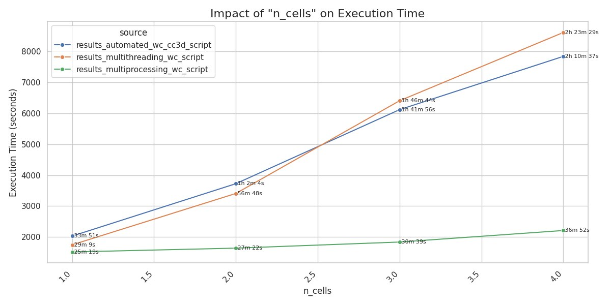
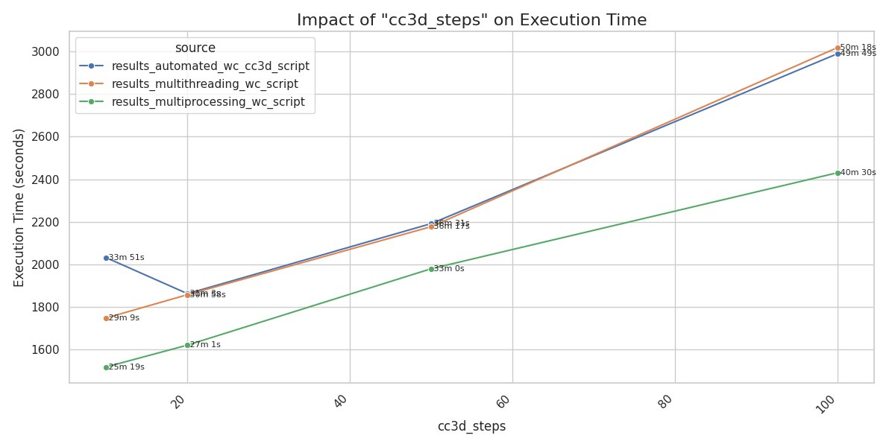
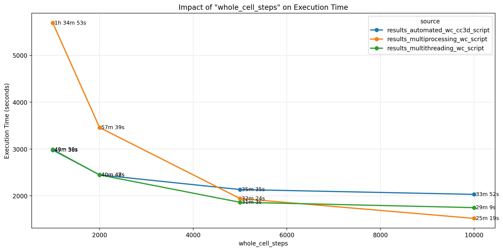
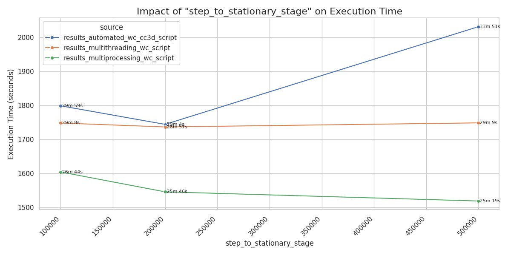

# Benchmark 03 — Bacteria Whole-Cell (ELMs)

<p align="center">
  
</p>

## Objective

This benchmark couples a **rod-shaped bacterium geometry** (via custom CC3D plugins) with the **intracellular translation kinetics model**. It evaluates computational performance across different coupling parameters, laying the groundwork for **Engineered Living Materials (ELMs)** simulations where intracellular state impacts collective behavior.

## Method

The benchmark runs multiple configurations varying:
- **n_cells:** number of bacteria
- **cc3d_steps:** CPM steps per coupling iteration
- **whole_cell_steps:** translation kinetics steps per coupling
- **step_to_stationary_stage:** warm-up steps for the translation model

Three execution strategies are compared:
- `automated_wc_cc3d_script` — sequential execution
- `multithreading_wc_script` — threaded parallelism
- `multiprocessing_wc_script` — process-based parallelism

## How to run

```bash
python make_benchmark.py
```

## Results

### Impact of number of cells

<p align="center">
  
</p>

Execution time scales with the number of bacteria. The multiprocessing approach shows significant speedup over sequential and multithreaded variants.

### Impact of CC3D steps

<p align="center">
  
</p>

More CPM steps per coupling iteration increase the time spent on lattice updates. All strategies show similar linear scaling.

### Impact of whole-cell steps

<p align="center">
  
</p>

More translation kinetics steps per iteration increase intracellular computation. Multiprocessing parallelizes this effectively.

### Impact of warm-up steps

<p align="center">
  
</p>

The initial warm-up phase for the translation model adds a one-time cost. Multiprocessing amortizes this across workers.

## Output files

- `results/csvs/results_*.csv` — timing data for each execution strategy
- `results/figures/benchmark_*.jpg` — figures above

